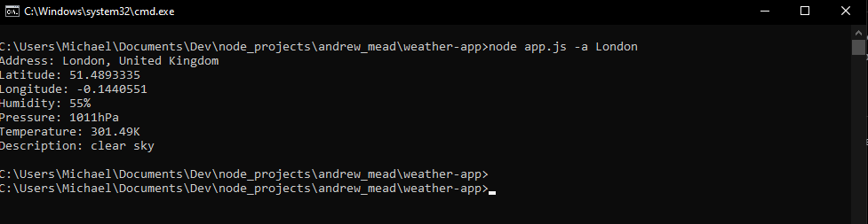

# Weather Application

## Description
This is a simple command-line weather application that fetches and displays current weather data using the OpenWeatherMap API, and OpenCageData API. Users can enter a city name, or zip code to get the current temperature, humidity, and pressure. As well, as the precise location of the reported weather, including longitude and latitude.

## Features
- Search for weather data by city name
- Search for weather data by zip code
- Fetches and displays current weather information including:
  - Temperature
  - Humidity
  - Pressure
- Fetches and displays current location information including:
  - Formatted address
  - Longitude
  - Latitude

## Installation
1. Clone the repository:
   ```sh
   git clone https://github.com/i-am-Shekinah/weather-app.git
   ```
2. Navigate to the project directory:
   ```sh
   cd weather-app
   ```
3. Install dependencies:
   ```sh
   npm install
   ```
4. Create a `.env` file in the root directory and add your OpenWeatherMap API key:
   ```sh
   WEATHERMAP_API_KEY=your_api_key
   ```
5. In the `.env` file, add your OpenCageData API key:
    ```sh
    OPENCAGE_API_KEY=your_api_key
    ```

## Usage
1. Run the application:
   ```sh
   node app.js -a <address> -u <unit>
   ```
   **The -a flag is mandatory, while the -u flag is optional. If the unit isn't supplied, the temperature is returned in the standard unit-Kelvin.**
   Run ```node app.js -h``` to learn more...


## Project Structure
```
weather-app/
├── geocode/
|   └── geocode.js
├── screenshots/
|   └── london-weather-data.png
├── weather
|   └── weather.js
├── .gitignore
├── app.js
├── LICENSE
├── package-lock.json
├── package.json
└── README.md
```

## Technologies Used
- Node.js
- OpenWeatherMap API
- OpenCageData API

## Example using a zip code
```sh
$ node app.js -a 200101 -u metric
Address: 200101, Puerto Ayora, Ecuador
Latitude: -0.7392196
Longitude: -90.3115486
Humidity: 84%
Pressure: 1015hPa
Temperature: 21.19C
Description: few clouds
```

## Example using a regular address
```sh
$ node app.js -a London
Address: London, United Kingdom
Latitude: 51.4893335
Longitude: -0.1440551
Humidity: 55%
Pressure: 1011hPa
Temperature: 301.49K
Description: clear sky
```

## Screenshots



## Contributing
Contributions are welcome! Please open an issue or submit a pull request for any changes or enhancements.

1. Fork the repository
2. Create your feature branch (`git checkout -b feature/AmazingFeature`)
3. Commit your changes (`git commit -m 'Add some AmazingFeature'`)
4. Push to the branch (`git push origin feature/AmazingFeature`)
5. Open a pull request

## License
This project is licensed under the MIT License - see the [LICENSE](LICENSE) file for details.

## Acknowledgements
- [OpenWeatherMap](https://openweathermap.org/) for providing the weather data API
- [OpenCageData](https://opencagedata.com/) for providing the location data API

## Contact
If you have any questions or feedback, feel free to contact me at [MichaelOlatunji.dev@gmail.com](mailto:MichaelOlatunji.dev@gmail.com)
